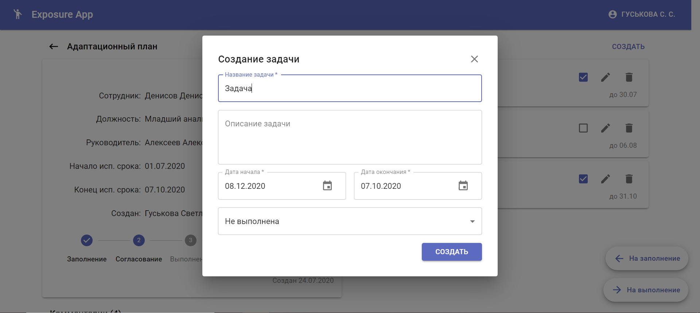

# Exposure App
Extremely convenient way to track your new employees affiliation progress.

## Как использовать
  После клонирования репозитория:
  ```
     npm install
     npm start
  ```
  Перейдите по ссылке: http://localhost:3001
  
## Данные для входа 
### hr:  
    username: Svetlana, 
    password: helloworld
    
### руководитель:  
    username: Kate, 
    password: helloworld
  
### сотрудник: 
    username: Denis,
    password: helloworld

## Скриншоты
### Страница входа


### Страница со списком планов

Содержит: 
* пагинацию, которая позволяет порционно выводить с сервера планы адаптации, соответствующие данной странице. 
* умный поиск, который ищет по должности сотрудника, ФИО сотрудника, ФИО руководителя. 

- - - -

### Popup для создания плана адаптации


- - - -

### Страница для работы с планом


- - - -


- - - -


Содержит: 
* карточку плана адаптации
* список задач 
* комментарии
* возможность редактировать карточку плана

- - - -

### Popup для создания задачи

    
